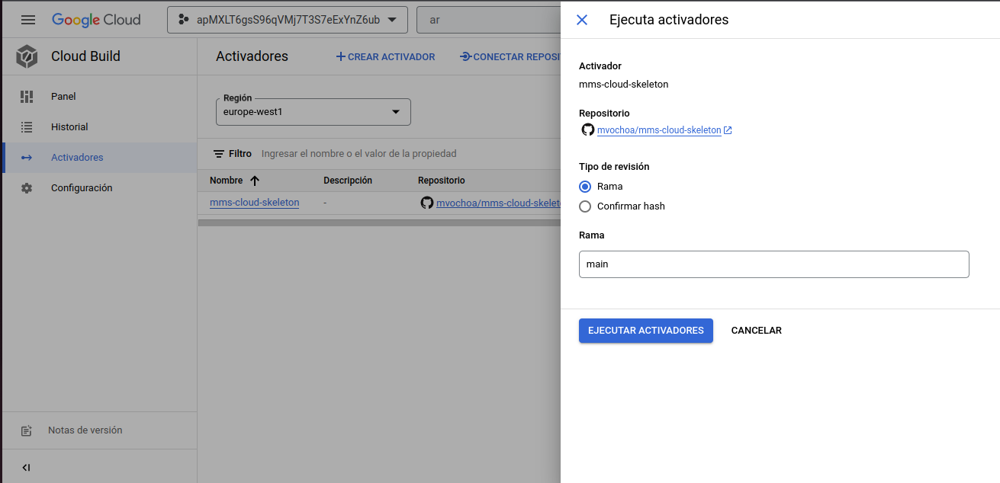

# MediaMarkt Hackathon - Challenge Solution <!-- omit in toc -->

Todo los archivos e instrucciones para este reto se encuentran en el repositorio [https://github.com/mvochoa/mediamarkt-hackathon-cloud](https://github.com/mvochoa/mediamarkt-hackathon-cloud)

- [Configuraciones](#configuraciones)
  - [Configuración del entorno de trabajo](#configuración-del-entorno-de-trabajo)
  - [Configuración de la aplicación](#configuración-de-la-aplicación)
  - [Configuración de Google Cloud](#configuración-de-google-cloud)
- [Aplicación de los manifiestos de terraform](#aplicación-de-los-manifiestos-de-terraform)
  - [(IMPORTANTE) Problema con permisos en Google Cloud](#importante-problema-con-permisos-en-google-cloud)
    - [Solución por la falta de permisos](#solución-por-la-falta-de-permisos)
- [Probando el funcionamiento del cloud build](#probando-el-funcionamiento-del-cloud-build)
- [Archivo de Docker Compose](#archivo-de-docker-compose)
- [Preguntas sobre los roles](#preguntas-sobre-los-roles)
  - [DevOps](#devops)
  - [Finanzas](#finanzas)


## Configuraciones

Es necesario configurar el entorno de trabajo, el repositorio de la aplicación al que se le va hacer el CI/CD y la consola de google cloud.

### Configuración del entorno de trabajo

Es necesario hacer un clone del repositorio [https://github.com/mvochoa/mediamarkt-hackathon-cloud](https://github.com/mvochoa/mediamarkt-hackathon-cloud) si se abre con el editor de visual studio code y tiene instalada la extension [Dev Containers](https://marketplace.visualstudio.com/items?itemName=ms-vscode-remote.remote-containers), el editor va configurado con todo lo que se requiere para trabajar.

En caso de que no use el editor y la extensión, los binarios que se requieren son:

- Terraform: `=> v1.4.2`
- Google Cloud CLI (gcloud): `La ultima versión`

Una vez configurado el entorno se requiere iniciar sesión en Google Cloud con el comando `gcloud auth application-default login` y seguir la instrucciones.

### Configuración de la aplicación

La aplicación a la se va a crear el CI/CD es [https://github.com/nuwe-io/mms-cloud-skeleton](https://github.com/nuwe-io/mms-cloud-skeleton), como yo no cuento con permisos en el repositorio, realice un fork a mi cuenta de github [https://github.com/mvochoa/mms-cloud-skeleton](https://github.com/mvochoa/mms-cloud-skeleton)

### Configuración de Google Cloud

Es necesario acceder a la consola de google cloud y al proyecto `apMXLT6gsS96qVMj7T3S7eExYnZ6ub` una vez dentro es necesario habilitar las siguientes APIs:

| Cloud Build               | Artifact Registry               | Kubernetes Engine               |
| ------------------------- | ------------------------------- | ------------------------------- |
|  |  |  |

Por ultimo es necesario conectar mi cuenta de GitHub con Cloud Build para que puede acceder al repositorio, el proceso es el siguiente:

| [](./.md/ConectarGitHub1.png) | [](./.md/ConectarGitHub2.png) | [](./.md/ConectarGitHub3.png) |
| ----------------------------------------------------------- | ----------------------------------------------------------- | ----------------------------------------------------------- |
|                                                             |                                                             |                                                             |

## Aplicación de los manifiestos de terraform

Toda la creación y configuración de los recursos de Google Cloud se hace con archivos de terraform, también los manifestos de Kubernetes (deployments, services, etc) se hace con el proveedor de terraform para kubernetes.

Primero se requiere crear un bucket para almacenar los archivos `.tfstate` de terraform para eso se necesario ejecutar los siguientes comandos:

```sh
$ cd src/init/
$ terraform init
$ terraform apply
...
Do you want to perform these actions?
  Terraform will perform the actions described above.
  Only 'yes' will be accepted to approve.

  Enter a value: yes

...

Apply complete! Resources: 2 added, 0 changed, 0 destroyed.

Outputs:

bucket = "08fe34899c02123a-tfstate"
```

Los recursos que se crearon son:

| Nombre                                                                                                                         | Tipo     | Descripción                                                         |
| ------------------------------------------------------------------------------------------------------------------------------ | -------- | ------------------------------------------------------------------- |
| [google_storage_bucket.default](https://registry.terraform.io/providers/hashicorp/google/latest/docs/resources/storage_bucket) | resource | Bucket donde se van almacenar los archivos `.tfstate` de terraform. |
| [random_id.bucket_prefix](https://registry.terraform.io/providers/hashicorp/random/latest/docs/resources/id)                   | resource | Se usa para generar un numero random para el nombre del bucket      |

Ahora una vez creado el bucket podemos aplicar el resto de manifiestos con los comandos:

```sh
$ cd ..
$ terraform init
$ terraform apply
...
Do you want to perform these actions?
  Terraform will perform the actions described above.
  Only 'yes' will be accepted to approve.

  Enter a value: yes

...

Apply complete! Resources: 7 added, 0 changed, 0 destroyed.

Outputs:

service = "http://130.211.57.127"
```

Los recursos que se crearon son:

| Nombre                                                                                                                                                              | Tipo        | Descripción                                                                                                                            |
| ------------------------------------------------------------------------------------------------------------------------------------------------------------------- | ----------- | -------------------------------------------------------------------------------------------------------------------------------------- |
| [google_artifact_registry_repository.mediamarkt-cloud](https://registry.terraform.io/providers/hashicorp/google/latest/docs/resources/artifact_registry_repository) | resource    | Repositorio donde se van almacenar las imágenes de docker construidas por el cloud build                                               |
| [google_cloudbuild_trigger.mms-cloud-skeleton](https://registry.terraform.io/providers/hashicorp/google/latest/docs/resources/cloudbuild_trigger)                   | resource    | El Cloud Build que se ejecuta cada vez que se hace push en la rama `main` del repositorio                                              |
| [google_container_cluster.mediamarkt-cloud](https://registry.terraform.io/providers/hashicorp/google/latest/docs/resources/container_cluster)                       | resource    |                                                                                                                                        |
| [google_container_node_pool.mediamarkt-cloud](https://registry.terraform.io/providers/hashicorp/google/latest/docs/resources/container_node_pool)                   | resource    |                                                                                                                                        |
| [kubernetes_config_map_v1.script](https://registry.terraform.io/providers/hashicorp/kubernetes/latest/docs/resources/config_map_v1)                                 | resource    | Manifiesto de kubernetes que contiene el script para forzar el cambio de la imagen cuando se sube una nueva al artifact registry       |
| [kubernetes_deployment_v1.mms-cloud-skeleton](https://registry.terraform.io/providers/hashicorp/kubernetes/latest/docs/resources/deployment_v1)                     | resource    | Manifiesto de Kubernetes para el deploy de la aplicación solo va generar un 1 pod                                                      |
| [kubernetes_service_v1.mms-cloud-skeleton](https://registry.terraform.io/providers/hashicorp/kubernetes/latest/docs/resources/service_v1)                           | resource    | Manifiesto de Kubernetes para el servicio que va generar un Load Balancer con una IP Publica para que se puede acceder a la aplicación |
| [google_client_config.default](https://registry.terraform.io/providers/hashicorp/google/latest/docs/data-sources/client_config)                                     | data source |                                                                                                                                        |
| [google_project.project](https://registry.terraform.io/providers/hashicorp/google/latest/docs/data-sources/project)                                                 | data source |                                                                                                                                        |

### (IMPORTANTE) Problema con permisos en Google Cloud

Por falta de permisos para el IAM de google cloud con en el usuario que se me asigno por el equipo de Nuwe, el cloud build no puede actualizar la imagen del deployment en kubernetes. Los recursos que no se aplicaron, están comentados en el archivo `src/cloudbuild.tf`

Los recursos que no se pueden crear son la asignación del rol de kubernetes a la cuenta de servicio del cloud build y los comandos para hacer el cambio de la imagen en el deployment de kubernetes:

```tf
resource "google_project_iam_member" "cloudbuild-kubernetes" {
  project = local.project
  role    = "roles/container.developer"
  member  = "serviceAccount:${data.google_project.project.number}@cloudbuild.gserviceaccount.com"
}

resource "google_cloudbuild_trigger" "mms-cloud-skeleton" {
  ...

  build {
    ...

    step {
      name       = "gcr.io/google.com/cloudsdktool/cloud-sdk"
      entrypoint = "gcloud"
      args       = ["container", "clusters", "get-credentials", local.cluster_name, "--region=${local.region}", "--project=${local.project}"]
    }

    step {
      name       = "gcr.io/google.com/cloudsdktool/cloud-sdk"
      entrypoint = "kubectl"
      args       = ["set", "image", "deployment/${local.repository_name}", "${local.repository_name}=${local.docker_image_name}"]
    }
  }
}
```

Los comandos que no va a poder ejecutar el cloud build son:

```sh
$ gcloud container clusters get-credentials mediamarkt-cloud --region=europe-west1 --project=apmxlt6gss96qvmj7t3s7eexynz6ub
$ kubectl set image deployment/mms-cloud-skeleton mms-cloud-skeleton=europe-west1-docker.pkg.dev/apmxlt6gss96qvmj7t3s7eexynz6ub/mediamarkt-cloud/mms-cloud-skeleton:$SHORT_SHA
```

#### Solución por la falta de permisos

Esta solución la encontré al revisar la cuenta de servicio de los nodes de kubernetes, encontre que cuentas con el permiso para acceder al cluster, por lo que internamente en el cluster se pueden ejecutar los comandos que no se pueden ejecutar en el cloud build por falta de permisos.

La solución consistió en agregar un contenedor al deployment de kubernetes de la aplicación, el cual se encarga de revisar regularmente (cada 5 min) si se subió una nueva imagen al artifact registry y cuando detecte una nueva imagen actualiza el deployment con esa nueva imagen. El script que ejecuta el contenedor es el siguiente:

```sh
#!/bin/bash

function GetTag() {
  TAG=$(gcloud artifacts docker images list --include-tags europe-west1-docker.pkg.dev/apmxlt6gss96qvmj7t3s7eexynz6ub/mediamarkt-cloud/mms-cloud-skeleton | grep latest | awk '{printf $3$4}')
  TAG="${TAG/latest/}"
  TAG="${TAG/,/}"
  printf $TAG
}

gcloud container clusters get-credentials mediamarkt-cloud --region=europe-west1 --project=apmxlt6gss96qvmj7t3s7eexynz6ub

IMAGE=$(kubectl get deployment mms-cloud-skeleton -o=jsonpath='{.spec.template.spec.containers[0].image}')

while true
do
  TAG=$(GetTag)

  if [[ "$IMAGE" != "europe-west1-docker.pkg.dev/apmxlt6gss96qvmj7t3s7eexynz6ub/mediamarkt-cloud/mms-cloud-skeleton:$TAG" ]];
  then
    kubectl set image deployment/mms-cloud-skeleton mms-cloud-skeleton=europe-west1-docker.pkg.dev/apmxlt6gss96qvmj7t3s7eexynz6ub/mediamarkt-cloud/mms-cloud-skeleton:$TAG
  fi

  sleep 300
done
```

De esta manera el CI/CD esta completo 🎉🎉🎉. Se que no es una manera muy limpia de resolver el problema pero al no poder asignar los permisos de manera correcta, fue la única forma que encontré para que el CI/CD funcionara.

## Probando el funcionamiento del cloud build

Se va hacer una ejecución manual del cloud build para ver la aplicación como esta actualmente

| [](./.md/TestOne1.png) | [](./.md/TestOne2.png) | [](./.md/TestOne3.png) |
| --------------------------------------------- | --------------------------------------------- | --------------------------------------------- |
|                                               |                                               |                                               |

Unos minutos después ya se puede puede visualizar en la IP [130.211.57.127](http://130.211.57.127/) del service de kubernetes la web

[](http://130.211.57.127/)

Ahora probamos subiendo cambios al repositorio para ver si todo el pipeline funciona correctamente, el cambio que se agrego fue:


| [](./.md/TestTwo1.png) | [](./.md/TestTwo2.png) |
| --------------------------------------------- | --------------------------------------------- |
|                                               |                                               |

[](http://130.211.57.127/)

## Archivo de Docker Compose

Al repositorio de github [https://github.com/mvochoa/mms-cloud-skeleton](https://github.com/mvochoa/mms-cloud-skeleton) se agrego el archivo `docker-compose.yaml` y se mejoro el `Dockerfile`.

El archivo [`docker-compose.yaml`](https://github.com/mvochoa/mms-cloud-skeleton/blob/main/docker-compose.yaml) se optimizo para que los desarrolladores puedan trabajar mas rápido y cómodo ya que se esta ejecutando un servidor de desarrollo y las `node_modules` se guardan en volumen.

```yaml
version: '3.8'
services:
  app:
    build:
      context: .
      target: builder
    ports:
      - 3000:3000
    volumes:
      - .:/app
      - node_modules:/app/node_modules
    command: sh -c 'yarn install && yarn run dev'

volumes:
  node_modules:
```

También se ajusto el archivo [`Dockerfile`](https://github.com/mvochoa/mms-cloud-skeleton/blob/main/Dockerfile) para que la imagen final sea mas liviana y con mejor rendimiento.


## Preguntas sobre los roles

### DevOps

Para la gestión del cluster de kubernetes en Google Cloud hay que asignarle al grupo, el rol de **Kubernetes
Engine Developer** este rol permite la gestión de los diferentes servicios que tenga el cluster.

### Finanzas

Para la gestión de la facturación en Google Cloud hay que asignarle al grupo, el rol de **Billing Account Viewer**,  este rol solo permite la gestión de la facturación.